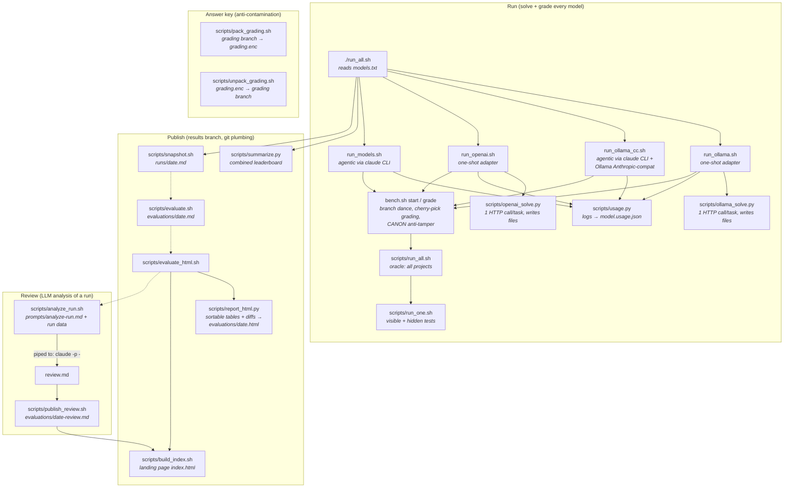

# Model Benchmark Kit

A small, self-contained suite of coding tasks for evaluating AI model output.
Each project has a **ground-truth oracle** (a test suite or stress harness) so
scoring is objective rather than eyeballed. Answers (`SOLUTION.md` + hidden
tests) live on a separate `grading` branch, so a model working on the clean
`main` branch can't see them.

**Live results:** https://epatel.github.io/model-benchmark/ — every run's
leaderboard and side-by-side solution diffs (served from the `results` branch).

## Setup

After cloning, enable the guard hook (blocks accidentally committing answer-key
files onto `main`):

```bash
git config core.hooksPath .githooks
```

## Requirements

- **python3** — projects 01/03/05/07/08/09 and all scoring scripts
- **go** — projects 02, 06 (`go test -race`)
- **node** — project 04 (`node --test`)
- **claude** CLI — for `run_models.sh` and `run_ollama_cc.sh` (agentic runners)
- **ollama** ≥ 0.30 — for `run_ollama.sh` (local models, or `:cloud` models after sign-in)
- **OPENAI_API_KEY** — for `run_openai.sh` (OpenAI models via the API)
- **openssl** — to decrypt the answer key (`scripts/unpack_grading.sh`)

## Results

Run results are snapshotted to the `results` branch as `runs/<date>.md`, and the
live combined table is always available via `python3 scripts/summarize.py`.

## Projects

**Tier 1** (baseline — current frontier models tend to ace these):

| # | Project | Lang | Task type | Oracle |
|---|---------|------|-----------|--------|
| 01 | `lru-cache` | Python | Bug fix (off-by-one eviction) | `unittest` |
| 02 | `bank-ledger` | Go | Bug fix (race condition) | `go test -race -count=20` |
| 03 | `csv-parser` | Python | Feature + edge-case bug | `unittest` |
| 04 | `rest-pagination` | Node/JS | Add a feature | `node --test` |
| 05 | `god-refactor` | Python | Refactor (behavior preserved) | `unittest` |

**Tier 2** (harder — designed to discriminate between strong models; in
practice 06 and 08 cause most failures across published runs, with 03's
hidden edge case an occasional third):

| # | Project | Lang | Task type | Oracle |
|---|---------|------|-----------|--------|
| 06 | `deadlock` | Go | Fix lock-ordering deadlock | `go test -race -count=5` (5s watchdog) |
| 07 | `perf-dedup` | Python | Fix O(n²) → linear (behavior preserved) | `unittest` (hidden time-budget test) |
| 08 | `event-bus` | Python | Multi-file feature + invariants | `unittest` (hidden snapshot/raise-safety) |

Tier-2 designs the *hidden* tests to carry the difficulty: 07's visible tests
pass on the slow code, and 08 hides its hard invariants — so a model that only
chases visible-green gets caught.

**Tier 3** (hardest — algorithmic rewrite under exact-semantics constraints):

| # | Project | Lang | Task type | Oracle |
|---|---------|------|-----------|--------|
| 09 | `glob-matcher` | Python | Exponential → polynomial rewrite, behavior identical | `unittest` (hidden 10s-watchdog perf + semantics probes + no-`re`/`fnmatch` guard) |

Tier-3 raises the bar: ALL visible tests pass on the seeded code (it is
*correct*, just exponentially slow), so a model must recognize the complexity
bug itself. The hidden tests then punish both inaction (adversarial perf cases
under a watchdog) and careless rewrites (class-bracket edge cases like `[]]`,
`[!]]`, unterminated `[`; no delegating to a regex engine).

Honesty note from published runs so far: every model passes 09 — the
"exponential recursion → memoize" pattern is universally recognized. In
practice tier-3 discriminates on *solution quality* (a surgical ~40-line memo
vs a ~120-line rewrite with dead code), which shows up in the edit stats and
run reviews rather than pass/fail.

## Script map

How the scripts call each other, from a full run to the published site:



Dashed arrows are the usual order you run them in after a run; everything in
**Publish**/**Review** commits to the `results` branch without touching your
working tree. `scripts/new_project.sh` (not shown) scaffolds a new task and
does the `grading`-branch dance — see `AGENTS.md`.

## Running models automatically (recommended)

The canonical model list lives in **`models.txt`** — one `<runner> <model>` per
line (`claude`, `ollama`, `ollama-cc`, or `openai`). Run **every** listed model and print
the combined leaderboard with one command:

```bash
./run_all.sh                 # runs everything in models.txt
./run_all.sh my-models.txt   # a different list
DRY=1 ./run_all.sh           # print the plan, run nothing
SNAPSHOT=0 ./run_all.sh      # skip the automatic results-branch snapshot
```

`run_all.sh` calls the four runners below in sequence. To run a subset
directly, call a runner with explicit model args instead.

Runners must not overlap **in the same worktree** (they check out
branches), but they can run in parallel across git worktrees — one runner per
worktree with disjoint model sets, then copy the second worktree's
`reports/<model>.*` back before summarizing. `bench.sh` is worktree-safe; see
the recipe in `AGENTS.md`. In practice this cuts a full run's wall time by
roughly a third (the slowest single model is the floor).

Four umbrella runners drive every task for every model, then grade + tabulate.
All share the git harness (see `WORKFLOW.md`) and write to `reports/`.

**Claude models** (agentic — edits files itself via `claude -p`):

```bash
./run_models.sh haiku sonnet opus       # or any model ids/aliases
```

**Ollama models** (local or `:cloud` — non-agentic; an adapter feeds the task
and writes back the model's file edits):

```bash
./run_ollama.sh glm-5.2:cloud kimi-k2.7-code:cloud   # cloud
./run_ollama.sh llama3.1                         # local
#   env: OLLAMA_URL (default http://localhost:11434)
```

**Ollama models, agentic** (`ollama-cc` in `models.txt`) — the same Ollama
models driven through the `claude` CLI via Ollama's [Anthropic-compatible
endpoint](https://docs.ollama.com/api/anthropic-compatibility), so they get
the identical agentic harness as Claude models (read TASK.md themselves,
explore, edit with tools over turns). Labels get a `-cc` suffix so both
harnesses of one model can sit side by side on the leaderboard:

```bash
./run_ollama_cc.sh glm-5.2:cloud     # -> reports/glm-5.2_cloud-cc.*
```

**OpenAI models** (non-agentic; same one-shot adapter shape as `run_ollama.sh` —
the model returns whole files, the adapter writes them back):

```bash
./run_openai.sh gpt-5.5 gpt-5.4
#   env: OPENAI_API_KEY (required), OPENAI_URL (default https://api.openai.com/v1),
#        OPENAI_EFFORT (pin reasoning effort for fair comparisons; default: model default)
```

Caveats: no prompt caching (all input tokens are fresh — expect millions), and
`cost_usd` is zeroed (Ollama reports no pricing).

Each model run produces, in `reports/`:
- `<model>.txt` — test log + `git diff --stat`
- `<model>.results.json` — per-project pass/fail + seconds
- `<model>.metrics.json` — edit counts (files / insertions / deletions)
- `<model>.usage.json` — time / tokens / turns / cost (mapped to one schema)

**Combined comparison table** across every model that has reports (Claude +
Ollama together) — sorted best-first, with time / tokens / cost / edits:

```bash
python3 scripts/summarize.py
```

To run every model in one shot, use `./run_all.sh` (above) instead of chaining
the runners by hand.

Notes when comparing across runners: Ollama models return whole files, so their
**edit-count** looks larger than Claude's surgical diffs; and cloud **cost**
shows `$0` (Ollama does not report pricing).

## Consolidating results into a branch

Snapshot the current `reports/` into a dated markdown file on a dedicated
`results` branch (leaderboard + per-model pass/fail), so run history is versioned
separately from the code:

```bash
./scripts/snapshot.sh                 # runs/<today>.md on branch `results`
./scripts/snapshot.sh 2026-07-01      # explicit date/label
```

For a **combined evaluation** — the leaderboard plus each failure's reproduced
output plus every model's per-task diff, consolidated from the `model/*`
branches into one doc:

```bash
./scripts/evaluate.sh                 # evaluations/<today>.md  (markdown)
./scripts/evaluate_html.sh            # evaluations/<today>.html (real tables + side-by-side diffs)
```

The HTML variant renders the leaderboard/grid as tables and every diff
side-by-side (via `difflib`), each collapsible. View it with:

```bash
git show results:evaluations/2026-07-01.html > /tmp/eval.html && open /tmp/eval.html
```

Both scripts use git plumbing — the working tree and current branch are never
touched. Browse without checking the branch out:

```bash
git ls-tree -r --name-only results        # list runs/*.md + evaluations/*.md
git show results:runs/2026-07-01.md          # leaderboard snapshot
git show results:evaluations/2026-07-01.md   # full combined evaluation
```

The `results` branch contains no answer keys, so it is safe to `git push origin results`.

## Analyzing a run (LLM review)

`prompts/analyze-run.md` is a reusable analyst prompt: summary breakdown,
solution reviews (root-causing failures, judging solution quality from the
diffs), and an efficiency analysis that **normalizes** across providers — Claude
(agentic, real `cost_usd`, heavy cached input over many turns) vs Ollama
(one-shot, `$0`, whole-file outputs) report on different axes, so it splits
fresh-vs-cached tokens, ranks cost only within Claude, and compares per-task.

`scripts/analyze_run.sh` bundles the prompt with a run's data (evaluation +
diffs + raw usage JSON) into one input:

```bash
./scripts/analyze_run.sh                 # latest run on the results branch
./scripts/analyze_run.sh 2026-07-01      # a specific run
./scripts/analyze_run.sh | claude -p -   # get the review from Claude (stdin)
./scripts/analyze_run.sh | pbcopy        # or paste into any model
```

(Prefer piping over `claude -p "$(...)"` — the bundle is ~170 kB and growing,
and a command-line argument that size eventually hits `ARG_MAX`.)

To publish the review next to the run it reviews (and link it from the live
landing page):

```bash
./scripts/analyze_run.sh | claude -p - > review.md
./scripts/publish_review.sh review.md            # -> results:evaluations/<date>-review.md
./scripts/build_index.sh                         # refresh the landing page (links review + evaluation + snapshot)
git push origin results
```

## How to run a single model by hand

1. Start from a **clean checkout** of a project (no prior model's edits).
2. Give the model the contents of that project's `TASK.md` as the prompt,
   plus access to the project directory **excluding** `SOLUTION.md` and the
   `*_hidden*` test files.
3. After the model finishes, score it:

   ```bash
   ./scripts/run_all.sh            # run every project, write results.json
   ./scripts/run_one.sh projects/01-lru-cache
   ```

   `run_one.sh` runs both the **visible** and **hidden** tests and reports
   pass/fail + duration. Passing visible but failing hidden = overfit.

## Files in each project

- `TASK.md` — the prompt shown to the model.
- `SOLUTION.md` — **hidden**: where the bug is / what "done" means. Don't show the model.
- source file(s) — contain the seeded defect (no telltale comments).
- `test_*.py` / `*_test.go` / `*.test.js` — **visible** tests (model may see).
- `*_hidden*` — **hidden** tests (catch overfitting). Don't show the model.
- `run_tests.sh` — runs visible + hidden tests; exit 0 = pass.

## Scoring guidance

Test pass/fail is the hard gate. For richer comparison also capture per run:
edits made, files touched, whether unrelated tests broke, time/tokens — the
runners record all of these in `reports/`, and the run review
(`scripts/analyze_run.sh`) judges solution quality from the diffs. For the
refactor (05), gate on tests then judge structure separately
(complexity/duplication reduction). A per-task LLM-as-judge rubric is an idea,
not built; today the closest thing is the review's solution-quality section.

## Grading answer key (encrypted)

The answer key — `SOLUTION.md` + the hidden tests — is **not** committed as
plaintext. If it were, AI-training crawlers that ingest this repo would absorb
the solutions and the benchmark would rot. Instead it ships as an encrypted
bundle, `grading.enc` (AES-256).

The point of the encryption is *only* to keep plaintext answers out of training
corpora — not to hide them from people. Training pipelines ingest text; they
don't run `openssl`. So the password is intentionally **public**, committed in
`grading.pass`, and the benchmark is fully clone-and-run:

```bash
./scripts/unpack_grading.sh          # reads grading.pass, rebuilds the `grading` branch
./run_all.sh                         # now you can grade
```

Maintainer, after changing/adding hidden tests or solutions:

```bash
./scripts/pack_grading.sh            # re-encrypt grading -> grading.enc (reads grading.pass)
git add grading.enc && git commit -m "update encrypted grading bundle" && git push
```

Integrity note: during a task a model only ever sees the clean `main` branch;
grading is applied afterward. This scheme deters *passive* training
contamination; it is not secrecy from a determined human (who can just read
`grading.pass` and decrypt). If you need real secrecy, delete `grading.pass` and
share the password out-of-band instead.

## See also

- **`WORKFLOW.md`** — the git branch model (`main` / `grading` / `model/*` /
  `grade/*`), how grading cherry-picks the hidden tests, and the anti-tamper step.
- **`AGENTS.md`** — the runbook for **adding a new task** (golden rules, oracle
  verification both ways, the grading-branch dance) plus the parallel-worktree
  recipe. `scripts/new_project.sh` automates the scaffold + branch dance.
- **`PLAN.md`** — roadmap and what's done (tiers, runners, snapshots, next steps).
- **`models.txt`** — the canonical list of models to benchmark.
